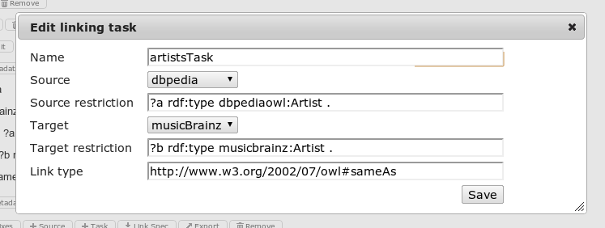

# Workbench

The Workbench is a web application for creating and executing data integration tasks.
All data integration tasks are hold in the workspace, which shows a tree view of all current projects.

## Projects

A project holds the following information:

1.  All URI prefixes which are used in the project.
2.  A list of data sources
3.  A list of linking tasks

Users are able to create new projects or import existing ones. Existing projects can be deleted or exported to a single file.

## Data Sets

A dataset represents a source or destination of data.
It may be used to read entities for transformation or interlinking. 
In the same way, it can be used to write transformed entities and generated links.
In the following, the most common types of datasets are described:

### SPARQL Endpoints

For SPARQL endpoints (type: `sparqlEndpoint`) the following parameters exist:

------------------------------------------------------------------------------------------------------------------------
Parameter Name                        Description                                                      Default
------------------------------------- ---------------------------------------------------------------- -----------------
endpointURI                           The URI of the SPARQL endpoint.

login                                 Login required for authentication                                No login

password                              Password required for authentication                             No password

instanceList                          A list of instances to be retrieved. If not given, all           Retrieve all 
                                      instances will be retrieved. Multiple instances can be 
                                      separated by a space.                 

pageSize                              Limits each SPARQL query to a fixed amount of results. The       1000
                                      SPARQL data source implements a paging mechanism which 
                                      translates the pagesize parameter into SPARQL LIMIT and OFFSET
                                      clauses. 

graph                                 Only retrieve instances from a specific graph.                   No restriction

pauseTime                             To allow rate-limiting of queries to public SPARQL severs, the   0
                                      pauseTime statement specifies the number of milliseconds to 
                                      wait between subsequent queries.

retryCount                            To recover from intermittent SPARQL endpoint connection          3
                                      failures, the retryCount parameter specifies the number of 
                                      times to retry connecting.     
                  
retryPause                            Specifies how long to wait between retries.                      1000

queryParameters                       Additional parameters to be appended to every request,
                                      e.g. &soft-limit=1   

parallel                              If multiple queries should be executed in parallel for faster    true
                                      retrieval
------------------------------------------------------------------------------------------------------------------------

#### Examples

**XML**

    <Dataset id="dbpedia" type="sparqlEndpoint">
      <Param name="endpointURI" value="http://dbpedia.org/sparql" />
      <Param name="retryCount" value="100" />
    </Dataset>      
    
#### RDF Dumps    
    
For RDF files (type: `file`) the following parameters exist:

----------------------------------------------------------------------------------------------------------------
Parameter            Description  
-------------------- -------------------------------------------------------------------------------------------
file (mandatory)     The location of the RDF file.  

format (mandatory)   The format of the RDF file. Allowed values: "RDF/XML", "N-TRIPLE", "TURTLE", "TTL", "N3"
----------------------------------------------------------------------------------------------------------------

Currently the data set is held in memory.    

Supported source formats:

- `RDF/XML` 
- `N-TRIPLE`
- `TURTLE`
- `TTL`
- `N3`

Supported output formats:

- `N-Triples`
- `Alignment`: Writes the links in the \[\[url:http://alignapi.gforge.inria.fr/format.html | OAEI Alignment Format\]\]. This includes not only the uris of the source and target entities, but also the confidence of each link.

## Transform Tasks

A transfom task generates new entities based on an extisting entities by transforming selected values.

## Linking Tasks

Linking tasks consist of the following elements:

1.  Metadata
2.  A link specification
3.  Positive and negative reference links

Linking Tasks can be added to an existing project and removed from it. Clicking on <code>Metadata</code> opens a dialog to edit the meta data of a linking task:

The following properties can be edited:

-   **Name** The unique name of the linking task
-   **Source** The source data set
-   **Source restriction** Restricts source dataset using SPARQL clauses
-   **Target** The target data set
-   **Target restriction** Restricts target dataset using SPARQL clauses
-   **Output** The data sink for writing generated links to

Clicking on the <code>open</code> button opens the Linkage Rule Editor.