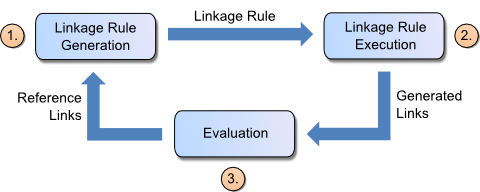

The Workbench is a web application which guides the user through the process of creating a link specification for interlinking two data sources.
It provides the following components:

-  [Workspace Browser](workspace.md) Enables the user to browse the projects in the workspace. Linking Tasks can be loaded from a project and comitted back to it later.
-  [Linkage Rule Editor](editor.md) A graphical editor which enables the user to easily create and edit linkage rules. The widget will show the current link specification in a tree view while allowing editing using drag-and-drop.
-  [Evaluation](evaluation.md) Allows the user to execute the current linkage rule. The links are displayed while they are generated on-the-fly. Generated links for which the reference link set does not specify their correctness, the user may confirm or decline their correctness. The user may request detailed summaries on how the similarity score of specific links is composed of.

The typical workflow of creating a new linking task consists of:

1. Before executing the actual matching, a linkage rule needs to be built, which specifies how two entities are compared for equivalence. Linkage Rules can be created by a human expert based on the data sources that are to be matched.
2. The linkage rule is executed, resulting in a set of links.
3. The purpose of the evaluation step is to measure the success of the entity matching task and to find potential errors in the generated links. The success of the entity matching task can be determined by comparing the generated links with a gold standard consisting of a set of reference links. A set of reference links consists of positive reference links that identify pairs of entities that are known to match and negative reference links that identify pairs that that are known non-matches. If no reference links are known, a gold standard can be generated by a human expert who confirms or rejects a number of links.